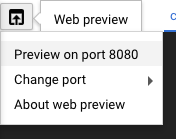
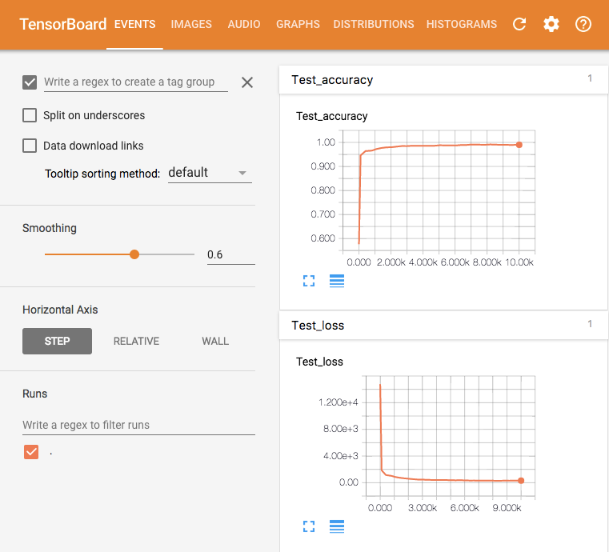

# Cloud MLE and GCE compatible TensorFlow distributed training example

Disclaimer: This is not an official Google product.

This is an example to demonstrate how to write distributed TensorFlow code
 which can be used on both Cloud Machine Learning Engine and Google Compute Engine
 instances.

## Products
- [TensorFlow][2]
- [Cloud Machine Learning Engine][3]
- [Cloud Datalab][9]

[1]: https://github.com/GoogleCloudPlatform/cloudml-samples/tree/master/mnist/distributed/trainer
[2]: https://www.tensorflow.org/
[3]: https://cloud.google.com/ml/
[9]: https://cloud.google.com/datalab/

## Prerequisites
1. A Google Cloud Platform Account
2. [A new Google Cloud Platform Project][4] for this lab with billing enabled
3. Enable the Cloud Machine Learning Engine API from [the API Manager][5]

[4]: https://console.developers.google.com/project
[5]: https://console.developers.google.com

## Do this first
In this section you will start your [Google Cloud Shell][6] and clone the
 application code repository to it.

1. [Open the Cloud Console][7]

2. Click the Google Cloud Shell icon in the top-right and wait for your shell
 to open:

 

3. List the models to verify that the command returns an empty list:

  ```
  $ gcloud ml-engine models list
  Listed 0 items.
  ```

  Note: After you start creating models, you can see them listed by using this command.

4. Clone the lab repository in your cloud shell, then `cd` into that dir.

  ```
  $ git clone https://github.com/GoogleCloudPlatform/cloudml-dist-mnist-example.git
  Cloning into 'cloudml-dist-mnist-example'...
  ...

  $ cd cloudml-dist-mnist-example
  ```

[6]: https://cloud.google.com/cloud-shell/docs/
[7]: https://console.cloud.google.com/

## Train the model on Cloud Machine Learning

1. Create a bucket used for training jobs.

  ```
  $ PROJECT_ID=$(gcloud config list project --format "value(core.project)")
  $ BUCKET="gs://${PROJECT_ID}-ml"
  $ gsutil mkdir -c regional -l us-central1 $BUCKET
  ```

2. Upload MNIST dataset to the training bucket.

  ```
  $ ./scripts/create_records.py 
  $ gsutil cp /tmp/data/train.tfrecords ${BUCKET}/data/
  $ gsutil cp /tmp/data/test.tfrecords ${BUCKET}/data/
  ```

Note: The dataset is stored in the [TFRecords][10] format.

[10]: https://www.tensorflow.org/api_guides/python/python_io#tfrecords_format_details

3. Submit a training job to Cloud Machine Learning.

  ```
  $ JOB_ID="${USER}_$(date +%Y%m%d_%H%M%S)"
  $ gcloud ml-engine jobs submit training ${JOB_ID} \
      --package-path trainer \
      --module-name trainer.task \
      --staging-bucket ${BUCKET} \
      --job-dir ${BUCKET}/${JOB_ID} \
      --runtime-version 1.2 \
      --region us-central1 \
      --config config/config.yaml \
      -- \
      --data_dir ${BUCKET}/data \
      --output_dir ${BUCKET}/${JOB_ID} \
      --train_steps 10000
  ```

  Note: `JOB_ID` can be arbitrary, but you can't reuse the same one.

  Note: Edit `config/config.yaml` to change the amount of resources
  to be allocated for the job.

  During the training, worker nodes show a training loss value (the total
  loss value for dataset in a single training batch) in some intervals.
  In addition, the master node shows a loss and accuracy for the testset
  about every 3 minutes.

  At the end of the training, the final evaluation against the testset is
  shown as below. In this example, it achieved 99.3% accuracy for the testset.

  ```
  Saving dict for global step 10008: accuracy = 0.9931, global_step = 10008, loss = 0.0315906
  ```

3. (Option) Visualize the training process with TensorBoard

  After the training, the summary data is stored in
  `${BUCKET}/${JOB_ID}` and you can visualize them with TensorBoard.
  First, run the following command on the CloudShell to start TensorBoard.

  ```
  $ tensorboard --port 8080 --logdir ${BUCKET}/${JOB_ID}
  ```

  Select 'Preview on port 8080' from Web preview menu in the top-left corner
  to open a new browser window:

  

  In the new window, you can use TensorBoard to see the training summary and
  the visualized network graph, etc.

  

## Deploy the trained model for predictions

1. Deploy the trained model and set the default version.

  ```
  $ MODEL_NAME=MNIST
  $ ORIGIN=$(gsutil ls ${BUCKET}/${JOB_ID}/export/Servo | tail -1)
  $ gcloud ml-engine models create ${MODEL_NAME} --regions us-central1
  $ VERSION_NAME=v1
  $ gcloud ml-engine versions create \
      --origin ${ORIGIN} \
      --model ${MODEL_NAME} \
      ${VERSION_NAME}
  $ gcloud ml-engine versions set-default --model ${MODEL_NAME} ${VERSION_NAME}
  ```

  Note: `MODEL_NAME` ane `VERSION_NAME` can be arbitrary, but you can't
  reuse the same one. It may take a few minutes for the deployed model
  to become ready. Until it becomes ready, it returns a 503 error against
  requests.

2. Create a JSON request file.

  ```
  $ ./scripts/make_request.py
  ```

  This creates a JSON file `request.json` containing 10 test data for
  predictions. Each line contains a MNIST image and a sequential key value.

3. Submot an online prediction request.

  ```
  $ gcloud ml-engine predict --model ${MODEL_NAME} --json-instances request.json
  CLASSES  PROBABILITIES
  7        [3.437006127094938e-21, 5.562060376991084e-16, 2.5538862785511466e-19, 7.567420805782991e-17, 2.891652426709158e-16, 2.2750016241705544e-20, 1.837758172149778e-24, 1.0, 6.893573298530907e-19, 8.065571390565747e-15]
  2        [1.2471907477623206e-23, 2.291396136267388e-25, 1.0, 1.294716955176118e-32, 3.952643278911311e-25, 3.526924652059716e-36, 3.607279481567486e-25, 1.8093850397574458e-30, 7.008172489249426e-26, 2.6986217649454554e-29]
  1        [5.45423318868473e-15, 1.0, 9.504595027687301e-12, 6.393277101537779e-16, 2.4266970655162368e-09, 1.674065400192326e-11, 5.571797797448985e-12, 1.3436474155525957e-10, 9.206201773137579e-11, 1.1845845552843799e-14]
  0        [1.0, 5.909986790816939e-19, 2.4125963203678984e-14, 6.702774370873354e-18, 1.6427204513119395e-14, 1.2845496049501432e-15, 1.942619459391337e-12, 1.5014800112869015e-13, 4.630940880876074e-16, 7.722024408796102e-12]
  4        [1.683408525966247e-15, 3.426583061416047e-15, 2.352944702683872e-14, 1.4354134652804144e-17, 1.0, 4.901479816097308e-14, 1.764131375703304e-13, 4.879935744842132e-16, 3.459843631210824e-13, 1.0766989513508185e-12]
  1        [1.6325680202852679e-15, 1.0, 1.65708375840512e-13, 1.280228757537301e-17, 5.987414036789929e-11, 1.184729804494175e-13, 3.078233265616133e-14, 2.1106190406516845e-10, 2.1799059085614303e-11, 3.1170367766660944e-15]
  4        [3.183327881731347e-25, 1.5531472253595656e-14, 8.822675326266091e-17, 1.1257204467406693e-23, 1.0, 3.675780366256499e-15, 2.509253215360222e-18, 1.948070958357668e-15, 7.695419301789741e-10, 1.5495283617957163e-14]
  9        [7.252868244881265e-20, 1.0792899474931612e-19, 3.0990492379377613e-16, 1.9092543500607597e-16, 3.1547468630488407e-12, 3.947477936670459e-16, 7.344393142182707e-25, 1.0551019585358889e-17, 7.17420805922131e-13, 1.0]
  5        [6.770833673326029e-15, 2.2513067020667885e-17, 4.9216548513263305e-19, 1.441009507560458e-17, 4.733751198914959e-15, 0.9999998807907104, 6.701989718749246e-08, 5.521230514480798e-19, 5.276084458216701e-09, 4.1348588442069456e-10]
  9        [5.124952379488745e-22, 1.917571388490136e-20, 2.02434602684524e-21, 2.1246177460406675e-18, 1.8790316524963657e-11, 2.7904309518969085e-14, 7.973171243464317e-26, 6.233734909559877e-14, 9.224547341257772e-12, 1.0]
  ```

  `CLASSES` is the most probable digit of the given image, and `PROBABILITIES` shows the probabilities of each digit.

## Using online prediction from Datalab

You can use the Datalab notebook to demonstrate the online prediction feature in an interactive manner.

1. Launch Datalab from the Cloud Shell.

  ```
  $ datalab create mydatalab --zone us-central1-a
  ...
  Click on the *Web Preview* (up-arrow button at top-left), select *port 8081*, and start using Datalab.
  ```
  
2. Select 'Preview on port 8081' from Web preview menu in the top-left corner to open a Datalab window.

3. Open a new notebook and execute the following command.

  ```
  %%bash
  git clone https://github.com/GoogleCloudPlatform/cloudml-dist-mnist-example
  ```
  
4. Go back to the notebook list window and open `Online prediction example.ipynb` in `cloudml-dist-mnist-example/notebooks` folder.

5. Follow the [instruction](https://github.com/GoogleCloudPlatform/cloudml-dist-mnist-example/blob/master/notebooks/Online%20prediction%20example.ipynb) in the notebook.

## (Option) Training on VM instances

Optionally, you can train the model using VM instances running on
 Google Compute Engine(GCE).
1. Launch four VM instances with the following options.

  - Hostname: ps-1, master-0, worker-0, worker-1
  - OS image: ubuntu-1604-lts
  - Machine type: n1-standard-1
  - Identity and API access: Set access for each API, Storage = 'Read Write'

  Note: Since instance roles are inferred from their hostnames,
  you must set hostnames exactly as specified.

2. Install TensorFlow

  Open ssh terminal and run the following commands on all instances.

  ```
  $ sudo apt-get update
  $ sudo apt-get install -y python-pip python-dev
  $ sudo pip install --upgrade tensorflow
  ```

3. Create a bucket used for training jobs and upload MNIST dataset.

  Run the following commands on the CloudShell. 

  ```
  $ git clone https://github.com/GoogleCloudPlatform/cloudml-dist-mnist-example.git
  $ cd cloudml-dist-mnist-example
  $ PROJECT_ID=$(gcloud config list project --format "value(core.project)")
  $ BUCKET="gs://${PROJECT_ID}-ml"
  $ gsutil mkdir $BUCKET
  ```
  ```
  $ ./scripts/create_records.py 
  $ gsutil cp /tmp/data/train.tfrecords ${BUCKET}/data/
  $ gsutil cp /tmp/data/test.tfrecords ${BUCKET}/data/
  ```

4. Start training

  Run the following commands on the CloudShell. It distributes executable
  files to all instances and start a training job.

  ```
  $ gcloud config set compute/zone us-east1-c
  $ ./scripts/start-training.sh $BUCKET
  ```

  Note: `us-east1-c` should be the zone of instances you have created.

  When the training is finished, the storage path containing the model binary
  will be displayed as below.
  
  ```
  Trained model is stored in gs://cloudml-sample-ml/job_170415_081023/export/Servo/1492245350557/
  ```
  
## Clean up

Clean up is really easy, but also super important: if you don't follow these
 instructions, you will continue to be billed for the project you created.

To clean up, navigate to the [Google Developers Console Project List][8],
 choose the project you created for this lab, and delete it. That's it.

[8]: https://console.developers.google.com/project
